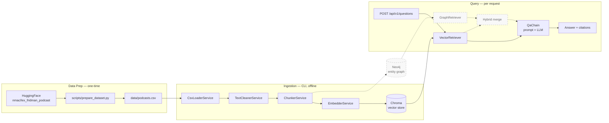

# hybrid-rag-podcasts

A hybrid RAG (vector + graph) Q&A system over podcast transcripts. Users ask natural-language questions about podcast content; the system returns grounded answers with mandatory source attribution. Built as a portfolio artifact demonstrating AI-augmented backend engineering — combining NestJS, LangChain.js (LCEL), Chroma (vector store), and Neo4j (entity graph) in a single TypeScript service.

> The full project constitution — architectural decisions, hard constraints, conventions, and phase roadmap — lives in [`CLAUDE.md`](./CLAUDE.md). Read it first.

## How it fits together



Data Prep and Ingestion run once at setup time while Query runs per user request, and the dashed nodes/edges (Neo4j entity graph, GraphRetriever, hybrid merge) are Phase 3+ additions not yet implemented — see [`docs/architecture.md`](./docs/architecture.md) for detailed sequence diagrams.

## Prerequisites

**Always required:**

- Node.js >= 20 (developed on Node 24)
- npm 10+
- An OpenAI API key
- Chroma (Phase 1+): local server reachable at the configured `CHROMA_PATH` collection
- Neo4j (Phase 3+): community edition or Aura

**Only required if you want the full Lex Fridman dataset (skip if you use the sample CSV):**

- Python >= 3.9 (developed on 3.10) with `pip` available
- ~300 MB free disk space for the HuggingFace dataset cache (one-time download) plus ~40 MB for the generated `data/podcasts.csv`
- Internet connection for the first run (subsequent runs use the local HF cache)
- *No HuggingFace account needed* — the `nmac/lex_fridman_podcast` dataset is public.

## Install

```bash
npm install
```

## Environment setup

Copy `.env.example` to `.env` and fill in real values:

```bash
cp .env.example .env
```

All env variables are validated at startup via a Zod schema (`src/common/config/env.schema.ts`). Missing or invalid env will fail boot fast with a descriptive error.

| Variable | Required | Default | Purpose |
|---|---|---|---|
| `NODE_ENV` | no | `development` | Runtime mode |
| `PORT` | no | `3000` | HTTP server port |
| `OPENAI_API_KEY` | yes | — | OpenAI credential |
| `OPENAI_MODEL` | no | `gpt-4o-mini` | Generation model |
| `EMBEDDING_MODEL` | no | `text-embedding-3-small` | Embedding model |
| `CHROMA_PATH` | no | `./data/chroma` | Local Chroma collection path |
| `CHROMA_COLLECTION` | no | `podcasts` | Chroma collection name |

## Data preparation

This project requires a CSV of podcast transcripts before vector ingestion.

### Option 1 — Sample dataset (instant)

A 15-episode sample ships in `data/sample-podcasts.csv` for quick testing. Skip directly to "Usage".

### Option 2 — Full dataset (Lex Fridman podcast, 319 episodes)

Run the one-time data prep script. This is the **only** time Python is used in the project; everything else is TypeScript.

#### Step 1 — Verify Python

```bash
python --version    # must report 3.9 or newer
python -m pip --version
```

If `pip` is missing, install it with `python -m ensurepip --upgrade`.

#### Step 2 — Recommended: use a virtual environment

A virtual environment isolates the dataset-prep packages from your system Python. It's strongly recommended — the script needs ~250 MB of Python dependencies.

**Windows (PowerShell):**

```powershell
python -m venv .venv
.\.venv\Scripts\Activate.ps1
```

If PowerShell blocks the activation script with an execution-policy error, run once per user:

```powershell
Set-ExecutionPolicy -Scope CurrentUser RemoteSigned
```

**Windows (cmd.exe):**

```cmd
python -m venv .venv
.venv\Scripts\activate.bat
```

**macOS / Linux:**

```bash
python -m venv .venv
source .venv/bin/activate
```

After activation your prompt should show `(.venv)`. The `.venv/` directory is gitignored.

#### Step 3 — Install Python deps and run the script

```bash
pip install -r scripts/requirements.txt
python scripts/prepare_dataset.py
```

This produces `data/podcasts.csv` (~40 MB, gitignored). First-run cost: ~215 MB downloaded into the HuggingFace cache at `~/.cache/huggingface/`; subsequent runs reuse it.

When you're done with the prep script you can deactivate the venv (`deactivate`) — the resulting CSV is the only artifact the rest of the project cares about.

#### Troubleshooting

| Symptom | Fix |
|---|---|
| `ModuleNotFoundError: No module named 'huggingface_hub'` (or similar) when running the script | You skipped or partially ran `pip install`. Re-run `pip install -r scripts/requirements.txt` inside the activated venv. |
| `TypeError: unsupported operand type(s) for /: 'str' and 'int'` | An old copy of `prepare_dataset.py` is in use. Pull the latest — the `end` column is a `HH:MM:SS.mmm` string and must go through `parse_timestamp_to_seconds`. |
| Script hangs at "Loading dataset from HuggingFace…" on first run | Initial dataset download is ~200 MB; check your network. After the first successful run it loads from local cache instantly. |
| PowerShell "running scripts is disabled" when activating venv | Run `Set-ExecutionPolicy -Scope CurrentUser RemoteSigned` once, then retry activation. |
| Disk space pressure | Output CSV is ~40 MB; the HF cache (`~/.cache/huggingface/`) is ~215 MB. You can delete the cache after the CSV is generated — it will be re-downloaded on next run. |

## Usage

### Step 1: Ingest the CSV into the vector store

```bash
# With sample
npm run cli -- ingest --csv data/sample-podcasts.csv --reset

# With full dataset (after data preparation)
npm run cli -- ingest --csv data/podcasts.csv --reset
```

> The `ingest` command lands in Phase 1.4. Until then, `npm run cli -- --help` lists the built-in CLI help.

### Step 2: Start the HTTP server

```bash
npm run start:dev
```

The server starts on `http://localhost:3000`. Health check:

```bash
curl http://localhost:3000/health
# {"status":"ok","timestamp":"..."}
```

### Step 3: Ask questions

```bash
curl -X POST http://localhost:3000/api/v1/questions \
  -H 'Content-Type: application/json' \
  -d '{"question":"What did guests say about AGI?"}'
```

> The questions endpoint lands in Phase 1.7. Until then, only `/health` responds.

## Other scripts

| Command | Purpose |
|---|---|
| `npm run build` | Compile TypeScript to `dist/` |
| `npm run start:prod` | Run compiled HTTP server |
| `npm run lint` | ESLint (`no-explicit-any` and `no-floating-promises` are errors) |
| `npm run format` | Prettier write |
| `npm test` | Jest unit tests |

## Architecture overview

See [`CLAUDE.md`](./CLAUDE.md) for the authoritative architecture, foundation reasoning, hard constraints, and phase tracking. In short:

- **Single NestJS service** owns HTTP, CLI, and all LangChain orchestration. No Python sidecar.
- **LCEL composition** is mandatory for every retriever and chain.
- **Vector store (Chroma)** holds transcript chunks + metadata.
- **Graph store (Neo4j, Phase 3+)** holds the entity graph (Episode / Person / Company).
- **Bridge** between stores is shared identifiers (`episode_id`, `guest_name`).
- **Repository pattern** wraps every external client.

Skills under `.claude/skills/` enforce NestJS and LangChain.js conventions when working with Claude Code.
