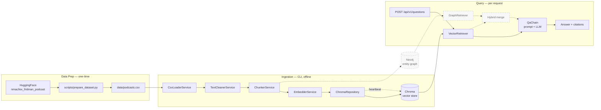

# hybrid-rag-podcasts

A hybrid RAG (vector + graph) Q&A system over podcast transcripts. Users ask natural-language questions about podcast content; the system returns grounded answers with mandatory source attribution. Built as a portfolio artifact demonstrating AI-augmented backend engineering — combining NestJS, LangChain.js (LCEL), Chroma (vector store), and Neo4j (entity graph) in a single TypeScript service.

> The full project constitution — architectural decisions, hard constraints, conventions, and phase roadmap — lives in [`CLAUDE.md`](./CLAUDE.md). Read it first.

## How it fits together



Data Prep and Ingestion run once at setup time while Query runs per user request, and the dashed nodes/edges (Neo4j entity graph, GraphRetriever, hybrid merge) are Phase 3+ additions not yet implemented — see [`docs/architecture.md`](./docs/architecture.md) for detailed sequence diagrams.

## Prerequisites

**Always required:**

- Node.js >= 20 (developed on Node 24)
- npm 10+
- An OpenAI API key (for chat / generation — Phase 1.6+)
- A Google AI Studio API key (free tier — for embeddings)
- Docker Desktop (or any Docker engine + `docker compose`) — runs the local Chroma server
- Neo4j (Phase 3+): community edition or Aura

**Only required if you want the full Lex Fridman dataset (skip if you use the sample CSV):**

- Python >= 3.9 (developed on 3.10) with `pip` available
- ~300 MB free disk space for the HuggingFace dataset cache (one-time download) plus ~40 MB for the generated `data/podcasts.csv`
- Internet connection for the first run (subsequent runs use the local HF cache)
- *No HuggingFace account needed* — the `nmac/lex_fridman_podcast` dataset is public.

## Install

```bash
npm install
```

## Environment setup

Copy `.env.example` to `.env` and fill in real values:

```bash
cp .env.example .env
```

All env variables are validated at startup via a Zod schema (`src/common/config/env.schema.ts`). Missing or invalid env will fail boot fast with a descriptive error.

| Variable | Required | Default | Purpose |
|---|---|---|---|
| `NODE_ENV` | no | `development` | Runtime mode |
| `PORT` | no | `3000` | HTTP server port |
| `OPENAI_API_KEY` | yes | — | OpenAI credential (Phase 1.6+ chat) |
| `OPENAI_MODEL` | no | `gpt-4o-mini` | Generation model |
| `GOOGLE_API_KEY` | yes | — | Google Gemini credential (embeddings) |
| `EMBEDDING_PROVIDER` | no | `gemini` | Reserved for future swap |
| `EMBEDDING_MODEL` | no | `text-embedding-004` | Gemini embedding model (768 dim) |
| `EMBEDDING_BATCH_SIZE` | no | `100` | Chunks per Gemini API call |
| `EMBEDDING_CONCURRENCY` | no | `5` | Parallel in-flight embedding batches |
| `CHROMA_URL` | no | `http://localhost:8000` | Chroma HTTP endpoint |
| `CHROMA_COLLECTION` | no | `podcasts` | Chroma collection name |
| `CHROMA_DISTANCE_METRIC` | no | `cosine` | HNSW distance metric |
| `CHROMA_WRITE_BATCH_SIZE` | no | `500` | Vectors per upsert call |
| `CHROMA_WRITE_CONCURRENCY` | no | `3` | Parallel in-flight upsert batches |
| `CHROMA_WRITE_TIMEOUT_MS` | no | `30000` | Per-batch timeout (ms) |
| `CHROMA_WRITE_MAX_RETRIES` | no | `3` | Retry budget per batch on transient errors |
| `CHROMA_API_KEY` | no | — | Required for Chroma Cloud / auth-enabled servers |
| `CHROMA_API_KEY_HEADER` | no | `X-Chroma-Token` | Header name carrying the API key |
| `CLEANING_REMOVE_INTRO` | no | `true` | Strip Lex Fridman intro anchor |
| `CLEANING_REMOVE_OUTRO` | no | `true` | Strip Lex Fridman outro anchor |

> For full descriptions and production tuning hints, see `.env.example`.

## Run Chroma locally

Chroma is the vector store. We run it via `docker compose`; the same image and config work locally and in production.

```bash
docker compose up -d chroma       # start in the background
docker compose ps                 # show status (look for "healthy")
docker compose logs -f chroma     # tail server logs
docker compose down               # stop and remove containers (data volume persists)
```

The container exposes Chroma on `http://localhost:8000` and persists data to a Docker-managed named volume (`chroma-data`). We use a named volume rather than a host bind mount because on Windows the bind-mount filesystem translation makes Chroma's many-small-writes pattern 10-20× slower; the named volume keeps storage on Docker's internal Linux filesystem at native speed and matches production Kubernetes / Docker patterns. On Linux/macOS the speed is identical either way. The healthcheck runs every 10 s; ingestion fails fast if Chroma is not reachable. Verify manually with:

```bash
curl http://localhost:8000/api/v1/heartbeat
# {"nanosecond heartbeat": 1700000000000000000}
```

## Data preparation

This project requires a CSV of podcast transcripts before vector ingestion.

### Option 1 — Sample dataset (instant)

A 15-episode sample ships in `data/sample-podcasts.csv` for quick testing. Skip directly to "Usage".

### Option 2 — Full dataset (Lex Fridman podcast, 319 episodes)

Run the one-time data prep script. This is the **only** time Python is used in the project; everything else is TypeScript.

#### Step 1 — Verify Python

```bash
python --version    # must report 3.9 or newer
python -m pip --version
```

If `pip` is missing, install it with `python -m ensurepip --upgrade`.

#### Step 2 — Recommended: use a virtual environment

A virtual environment isolates the dataset-prep packages from your system Python. It's strongly recommended — the script needs ~250 MB of Python dependencies.

**Windows (PowerShell):**

```powershell
python -m venv .venv
.\.venv\Scripts\Activate.ps1
```

If PowerShell blocks the activation script with an execution-policy error, run once per user:

```powershell
Set-ExecutionPolicy -Scope CurrentUser RemoteSigned
```

**Windows (cmd.exe):**

```cmd
python -m venv .venv
.venv\Scripts\activate.bat
```

**macOS / Linux:**

```bash
python -m venv .venv
source .venv/bin/activate
```

After activation your prompt should show `(.venv)`. The `.venv/` directory is gitignored.

#### Step 3 — Install Python deps and run the script

```bash
pip install -r scripts/requirements.txt
python scripts/prepare_dataset.py
```

This produces `data/podcasts.csv` (~40 MB, gitignored). First-run cost: ~215 MB downloaded into the HuggingFace cache at `~/.cache/huggingface/`; subsequent runs reuse it.

When you're done with the prep script you can deactivate the venv (`deactivate`) — the resulting CSV is the only artifact the rest of the project cares about.

#### Troubleshooting

| Symptom | Fix |
|---|---|
| `ModuleNotFoundError: No module named 'huggingface_hub'` (or similar) when running the script | You skipped or partially ran `pip install`. Re-run `pip install -r scripts/requirements.txt` inside the activated venv. |
| `TypeError: unsupported operand type(s) for /: 'str' and 'int'` | An old copy of `prepare_dataset.py` is in use. Pull the latest — the `end` column is a `HH:MM:SS.mmm` string and must go through `parse_timestamp_to_seconds`. |
| Script hangs at "Loading dataset from HuggingFace…" on first run | Initial dataset download is ~200 MB; check your network. After the first successful run it loads from local cache instantly. |
| PowerShell "running scripts is disabled" when activating venv | Run `Set-ExecutionPolicy -Scope CurrentUser RemoteSigned` once, then retry activation. |
| Disk space pressure | Output CSV is ~40 MB; the HF cache (`~/.cache/huggingface/`) is ~215 MB. You can delete the cache after the CSV is generated — it will be re-downloaded on next run. |

## Usage

### Step 1: Ingest the CSV into the vector store

Make sure Chroma is running (`docker compose up -d chroma`), then:

```bash
# With sample (15 episodes, ~3-5 s)
npm run cli -- ingest --csv data/sample-podcasts.csv --reset

# With full dataset (319 episodes, ~45-55 s)
npm run cli -- ingest --csv data/podcasts.csv --reset

# Override write concurrency for high-latency Chroma endpoints
npm run cli -- ingest --csv data/podcasts.csv --reset --concurrency 10
```

The `--reset` flag wipes the collection before writing. Without it, re-runs upsert idempotently — same `chunk_id` overwrites the same vector.

### Step 2: Start the HTTP server

```bash
npm run start:dev
```

The server starts on `http://localhost:3000`. Health check:

```bash
curl http://localhost:3000/health
# {"status":"ok","timestamp":"..."}
```

### Step 3: Ask questions

```bash
curl -X POST http://localhost:3000/api/v1/questions \
  -H 'Content-Type: application/json' \
  -d '{"question":"What did guests say about AGI?"}'
```

> The questions endpoint lands in Phase 1.7. Until then, only `/health` responds.

## Retrieval (Phase 1.5)

`VectorRetrieverService` (`src/modules/retrieval/`) turns a natural-language query into the top-K most relevant chunks from the Chroma collection. The HTTP endpoint that wraps it lands in Phase 1.7; until then the service is consumed programmatically — and from Phase 1.6 onward via LCEL composition inside the QA chain.

### Programmatic use

```typescript
import { VectorRetrieverService } from './modules/retrieval/vector-retriever.service';

const retriever = app.get(VectorRetrieverService);

// Default top-5
const chunks = await retriever.retrieve('What is consciousness?');

// All knobs
const chunks = await retriever.retrieve('artificial intelligence', {
  topK: 10,
  scoreThreshold: 0.5,                    // optional cosine-similarity floor
  filter: { episode_id: 'ep_001' },       // Chroma metadata filter
});

// chunks: RetrievedChunk[] — id, document, score ∈ [0, 1], metadata, chunkIndex
```

### LCEL composition (preview of Phase 1.6)

`toRunnable(options)` adapts the retriever for LangChain chain composition. Phase 1.6 will pipe it into the QA chain:

```typescript
const ragChain = retriever
  .toRunnable({ topK: 5 })           // Runnable<string, RetrievedChunk[]>
  .pipe(formatContext)               // chunks → context string
  .pipe(promptTemplate)              // (context, question) → prompt
  .pipe(llm)                         // prompt → LLM response
  .pipe(new StringOutputParser());

const answer = await ragChain.invoke('What is consciousness?');
```

### Tuning

| Env var | Default | Effect |
|---|---|---|
| `RETRIEVAL_DEFAULT_TOP_K` | `5` | Default `topK` when caller omits it |
| `RETRIEVAL_MAX_TOP_K` | `50` | Hard upper bound on `topK` (rejected with 400) |
| `RETRIEVAL_MIN_QUERY_LENGTH` | `3` | Reject queries below this (after trim) |
| `RETRIEVAL_MAX_QUERY_LENGTH` | `1000` | Reject queries above this (DoS guard) |

Query embeddings use Gemini `RETRIEVAL_QUERY` task type (separate from `RETRIEVAL_DOCUMENT` used during ingest). Both share the same project-level rate budget — see [Rate limits](#rate-limits).

The cosine score on returned chunks is `1 − L²/2` of the L2 distance reported by Chroma, clamped to `[0, 1]`. The math is exact for unit-normalized vectors; see [`docs/ADR/0003-vector-store-module-and-retrieval.md`](./docs/ADR/0003-vector-store-module-and-retrieval.md).

## Other scripts

| Command | Purpose |
|---|---|
| `npm run build` | Compile TypeScript to `dist/` |
| `npm run start:prod` | Run compiled HTTP server |
| `npm run lint` | ESLint (`no-explicit-any` and `no-floating-promises` are errors) |
| `npm run format` | Prettier write |
| `npm test` | Jest unit tests |

## Production deployment

The codebase is designed to run unchanged in any deployment topology. Only env variables change.

### Same host (Docker compose)

```env
CHROMA_URL=http://chroma:8000          # service name in compose network
CHROMA_WRITE_CONCURRENCY=3             # default is fine
CHROMA_WRITE_BATCH_SIZE=500            # default is fine
```

### Different VM, same datacenter

```env
CHROMA_URL=http://chroma.internal:8000  # private DNS
CHROMA_WRITE_CONCURRENCY=5              # network latency benefits parallelism
CHROMA_WRITE_BATCH_SIZE=1000            # fewer round-trips
```

### Chroma Cloud or different region

```env
CHROMA_URL=https://your-instance.chroma.run
CHROMA_API_KEY=<your-api-key>           # required for Chroma Cloud
CHROMA_WRITE_CONCURRENCY=10             # high latency rewards aggressive parallelism
CHROMA_WRITE_BATCH_SIZE=2000            # minimize round-trips
CHROMA_WRITE_TIMEOUT_MS=60000           # account for higher latency
```

### Pre-deployment checklist

- [ ] `CHROMA_URL` points to the production endpoint
- [ ] `CHROMA_API_KEY` set if using Chroma Cloud
- [ ] `CHROMA_WRITE_CONCURRENCY` tuned to network latency
- [ ] `CHROMA_WRITE_BATCH_SIZE` tuned to network latency
- [ ] Heartbeat reachable: `curl $CHROMA_URL/api/v1/heartbeat`
- [ ] Health check passes at ingestion startup (logs `Chroma server reachable at ...`)

## Rate limits

Gemini Tier 1 (free) enforces ~15 RPM on the `gemini-embedding-001` endpoint. `EmbedderService` runs a two-layer rate limiter — a proactive token bucket plus a short adaptive retry for stray 429s — so full ingestion completes in a single run rather than failing midway. To accelerate, set `EMBEDDING_REQUESTS_PER_MINUTE` to your tier's limit:

| Tier | Requirement | `EMBEDDING_REQUESTS_PER_MINUTE` | ~Full ingest (53K vectors) |
|---|---|---|---|
| 1 (free) | Default | `15` | ~50 minutes |
| 2 | $250 spend + 30 days | `60` | ~15 minutes |
| 3 | $1000+ spend | `200` | ~10 minutes |

Adaptive retry (default 10 attempts × 200ms → 2000ms backoff × 1.5 growth) handles any 429s that slip through the bucket. Atomic-success: any unrecoverable failure aborts the run — no half-populated collections.

## Architecture overview

See [`CLAUDE.md`](./CLAUDE.md) for the authoritative architecture, foundation reasoning, hard constraints, and phase tracking. In short:

- **Single NestJS service** owns HTTP, CLI, and all LangChain orchestration. No Python sidecar.
- **LCEL composition** is mandatory for every retriever and chain.
- **Vector store (Chroma)** holds transcript chunks + metadata.
- **Graph store (Neo4j, Phase 3+)** holds the entity graph (Episode / Person / Company).
- **Bridge** between stores is shared identifiers (`episode_id`, `guest_name`).
- **Repository pattern** wraps every external client.

Skills under `.claude/skills/` enforce NestJS and LangChain.js conventions when working with Claude Code.
