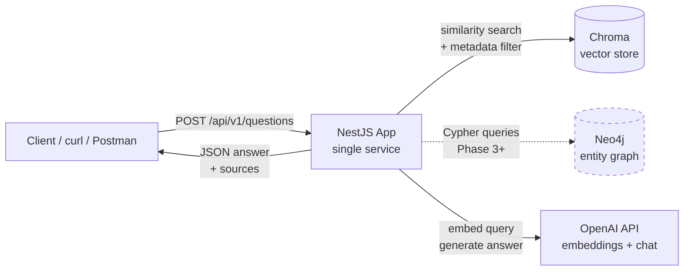
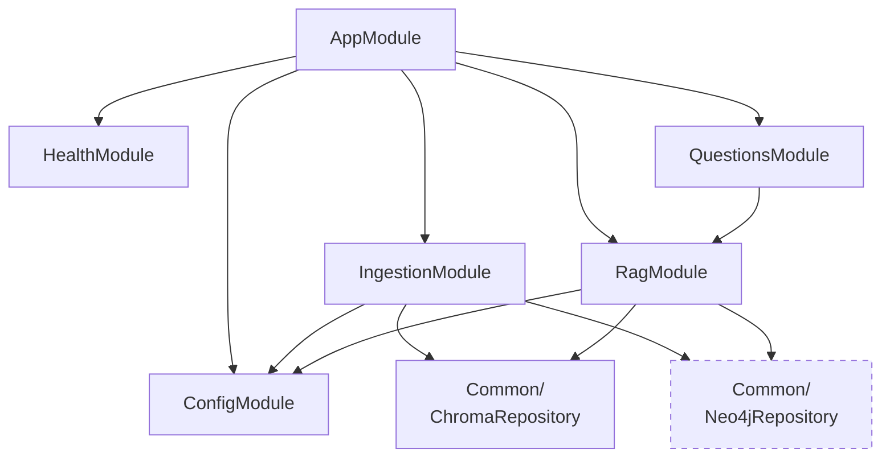
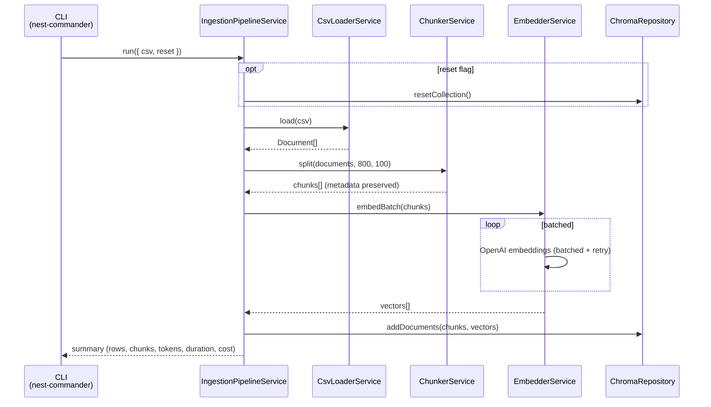
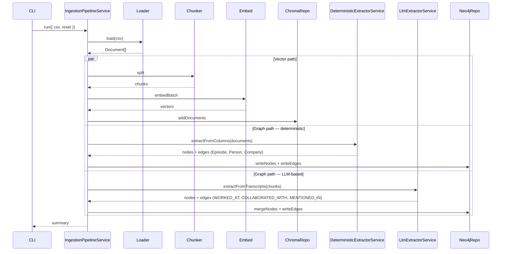
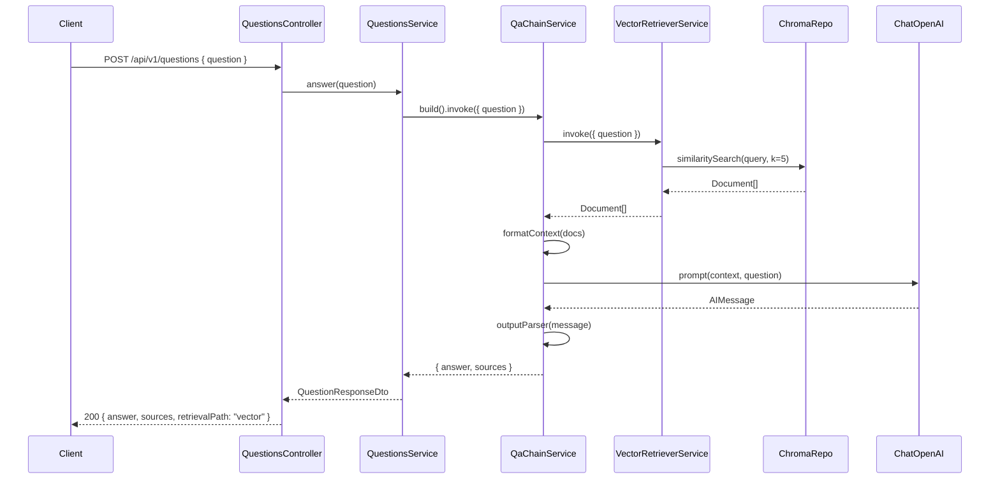
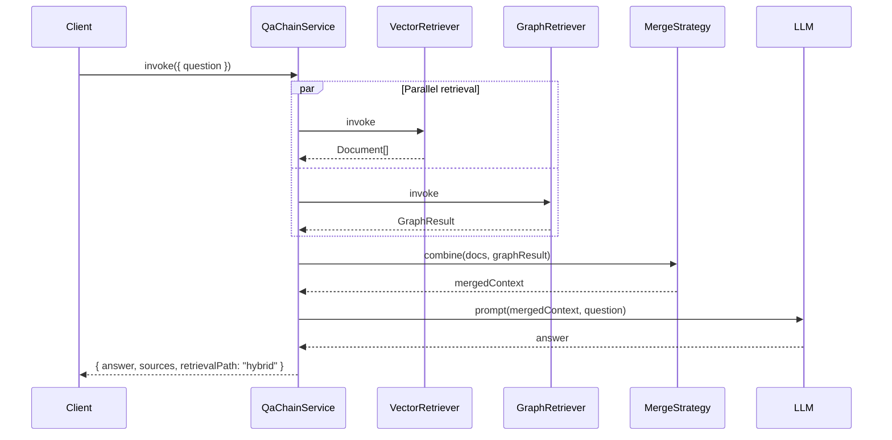
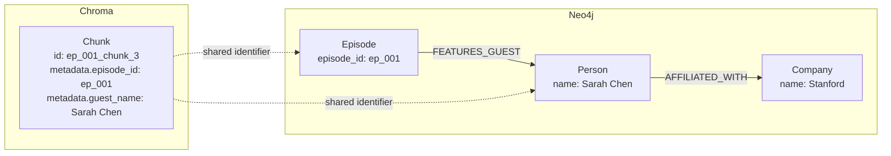

# Architecture — hybrid-rag-podcasts

This document is the technical companion to CLAUDE.md. CLAUDE.md captures the **decisions**; this file captures the **diagrams** that make those decisions easier to reason about.

---

## High-level system view



The Neo4j path is dashed because it is not in Phase 1. Vector retrieval is the only active path until Phase 3.

---

## Module dependency graph



`QuestionsModule` is the only module exposing HTTP endpoints. `IngestionModule` exposes CLI commands. `RagModule` is purely internal — consumed by `QuestionsModule`.

---

## Ingestion flow (Phase 1 — vector only)



Ingestion is one-shot. Each chunk has a deterministic ID (`{episode_id}_chunk_{idx}`) so re-running without `--reset` is a no-op for unchanged data.

---

## Ingestion flow (Phase 3+ — vector + graph)



Three parallel paths write to two stores. Entity resolution by `name` ensures the deterministic and LLM-based paths converge on the same Person nodes.

---

## Query flow — Phase 1 (vector only)



Single retrieval branch. LCEL chain is composed once at service construction; `.invoke()` is the only per-request call.

---

## Query flow — Phase 4 (hybrid)



`RunnableParallel` runs both branches concurrently. The `MergeStrategy` is a `RunnableLambda` deciding how to weave vector chunks and graph results into a single context string. Sequential variant (graph filters → vector searches inside subset) is a second `MergeStrategy` selected per query in Phase 5.

---

## Bridge between stores



Stores are linked by **shared identifier values**, not by foreign keys at the storage layer. Hybrid retrieval relies on these identifiers to filter Chroma based on Neo4j query results (e.g., "give me chunks where `guest_name` is in this list of names returned by Cypher").

---

## Phase progression overview

```mermaid
flowchart LR
    P1[Phase 1<br/>Vector + CLI + endpoint] --> P2[Phase 2<br/>Evaluation harness]
    P2 --> P3[Phase 3<br/>Graph layer]
    P3 --> P4[Phase 4<br/>Hybrid retrieval]
    P4 --> P5[Phase 5<br/>Query routing<br/>via tool use]
    P5 -.-> P6[Phase 6 (future)<br/>Queue-based ingestion]
```

Each phase ends with a shippable artifact. The dashed Phase 6 is opt-in based on portfolio strategy, not a hard dependency.